<h1 style="text-align: center; margin-top: 100px;">从零开始认识大语言模型</h1>
<h5 style="text-align: center; color: gray;">孔康懿 / 数据科学部 / 2025.04.18</h5>


<br>


# 引言

> **“语言的边界，即是世界的边界。” **——路德维希·维特根斯坦

语言不仅是人类沟通的工具，更是我们表达思维、建构知识的方式。从20世纪图灵测试的提出开始，科学家们就一直在探索：**如何让机器理解人类语言？** 语言建模（Language Modeling, LM）正是这个问题的核心技术之一。简单来说，它的目标是预测一句话中下一个最可能出现的词。比如我们说“猫喜欢吃……”，模型就要猜出后面是“鱼”还是“香蕉”。能否猜对，体现了它对语言的“理解”程度。

过去，研究者用统计规则来计算语言的概率关系；但如今，随着神经网络的兴起，我们有了新的答案：**通过深度学习训练出来的大规模语言模型**（Large Language Models, LLMs）。这些动辄挥舞几十亿参数的深度学习模型，比如ChatGPT、DeepSeek，不仅能续写句子，还能完成摘要、翻译、编程、写论文等任务，令人印象深刻。而这些能力的背后，靠的并不是人类给它设定规则，而是它通过海量语料自主“学”出来的。

一个重要发现是：当语言模型的参数足够多时，会突然出现一些“小模型不具备的新能力”，这类现象被称为“能力涌现（Emergent Abilities）”。这种现象类似于物理学中的相变（Phase Transition），即当某些条件达到临界点时，会突然出现新的性质。就像水到一定温度才会沸腾，大模型在某个“临界点”后也突然变聪明了。

以下是三种代表性的[涌现能力](https://arxiv.org/abs/2303.18223)，展示了大模型“类人智能”的雏形：

1. **语境学习（In-Context Learning, ICL）**
   给它几个例子，不用再训练，它就能“学会”新任务。例如看到“苹果→apple，香蕉→banana，猫→？”它就能答出“cat”，仿佛懂了“翻译”这个概念。

2. **指令跟随（Instruction Following）**
   你只需告诉它“请总结这段话”，它就能照做。这类似人类听指令办事，不需要写死流程。

3. **逐步推理（Step-by-Step Reasoning）**
   对于复杂问题，比如数学题或逻辑推理，大模型可以“先拆解，再作答”。比如计算“573+428”，它可以先按照列式加法的思路，按位数列出加法的步骤再求解，而不是直接乱猜答案。

这些能力使得 LLM 不再只是一个“文字接龙的工具”，而像是一个具备理解、泛化、推理能力的“语言智能体”。在我们日常使用 ChatGPT、搜索引擎或写作助手的背后，语言模型已悄然成为支撑 AI 能力的底层引擎。但这个“引擎”是怎么运作的？它真的理解我们说的话吗？它会犯什么样的错？这些问题的答案，关系到我们日常中如何正确地使用、信任和发展这类 AI 技术。

在今天的分享中，我们将从三个层面来解读语言模型的工作原理：

1. 技术原理：解释 LLM 是如何通过数学计算实现“理解语言”的。
2. 可解释性：我们如何“追踪模型的思考过程”，理解它背后到底“在想什么”。
3. 举例说明：通过简单的例子将复杂的模型架构串通起来。

希望通过这篇讲解，即便你是第一次接触大模型，也能带走三个关键词：**它是什么**、**它在想什么**、**它是如何工作的**？


<br>


# 从GPT-3理解Transformer：我们是如教会AI“说话”的？


在介绍 GPT-3 的技术细节之前，我们先来简单了解一下它背后的基本思想——什么是深度学习，以及它如何让机器拥有“语言能力”。

## 什么是深度学习？

你可以把深度学习理解成一种：教机器“自己学习规律”的方法。传统编程是由人去编写规则，比如

- “如果出现‘好吃’、‘喜欢’、‘推荐’这样的词，就判为好评”；
- “如果有‘难吃’、‘差劲’、‘不会再来’就判为差评”。

深度学习不写规则，而是让机器自己去从数据中“找规律”。怎么找？方法就是：设定一大堆自动调节的“旋钮”——这些就是模型的参数，然后用成千上万的例子来不断调这些旋钮，让它的输出越来越接近我们想要的结果。

比如说：我们想让模型学会判断预测一栋房子的价格。我们不再告诉它“房子大就贵”，而是提供很多“面积-价格”的真实样本，让模型自己通过调整“斜率”和“截距”两个参数，拟合出最合理的公式。这就是最简单的“线性回归模型”。

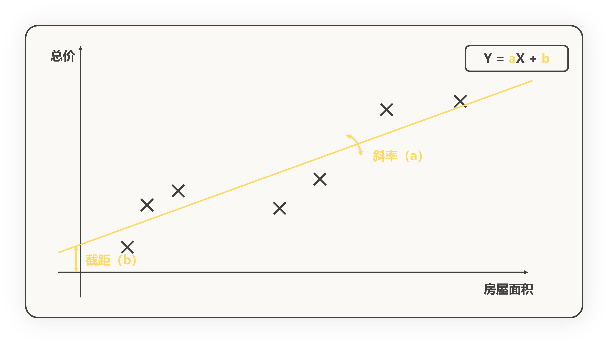

深度学习比线性回归要复杂得多。它用的是“神经网络”，有很多层，每层都在对输入数据做不同的处理。你可以把这个过程类比成“流水线”，网络的每一层各司其职（[点开这个网页试试看！](https://www.3blue1brown.com/lessons/neural-networks)）：

```html
📦 输入：一张猫的照片（比如一只趴在沙发上的橘猫）
					↓
🧠 中间处理：神经网络的每一层会自动提取不同的视觉特征：
    > 第一层可能提取边缘和线条（比如猫的轮廓）；
    > 第二层会识别出鼻子、耳朵、胡须等局部结构；
    > 更高层会组合成“猫脸”、“身体姿态”这些整体特征。
					↓
🧾 输出：最终一层输出一个概率分布，例如：
    > “猫”：92%
    > “狗”：6%
    > “沙发”：2%
```

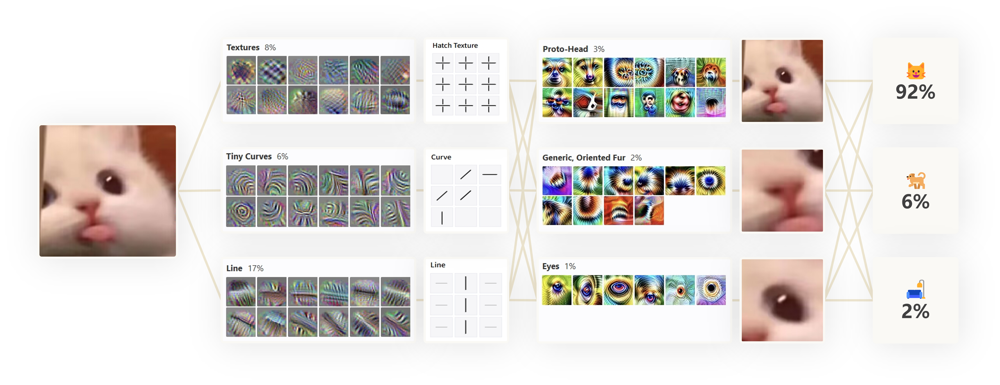

这种“把输入数据[编码成特征](https://distill.pub/2020/circuits/early-vision/) → 分层处理 → 解码出目标结果”的过程，就是我们今天要讲的深度学习的基本框架。

### 深度学习模型是怎么“学会语言”的？

GPT-3 背后的模型叫做 **Transformer**。它是目前处理文本最成功的神经网络结构之一。GPT 是 “Generative Pre-trained Transformer” 的缩写，意思是“**生成式的、预训练的 Transformer 模型**”。

- **生成式**：它不是被动判断，而是能主动输出文本，比如写诗、答题、讲笑话。
- **预训练**：它先在大量互联网文本上“读书学习”，之后才能适应各种任务。
- **Transformer**：是实现这一切的关键结构，我们稍后会详细介绍。

那它是怎么生成文本的呢？其实道理非常简单：**一句话一句话往下猜**。

比如你给它一个开头：“**起风了，记忆中姥姥家的狸花猫是**……”，模型会根据语义预测下一个最可能的词，比如“温暖的”、“慵懒的”或“灰黑花纹的”。它从预测中选一个，加到句子末尾，再用新句子继续预测，直到生成完整的一段话。这就是我们看到的 ChatGPT 逐字输出的原理：**不断预测 → 选择 → 接着预测**。

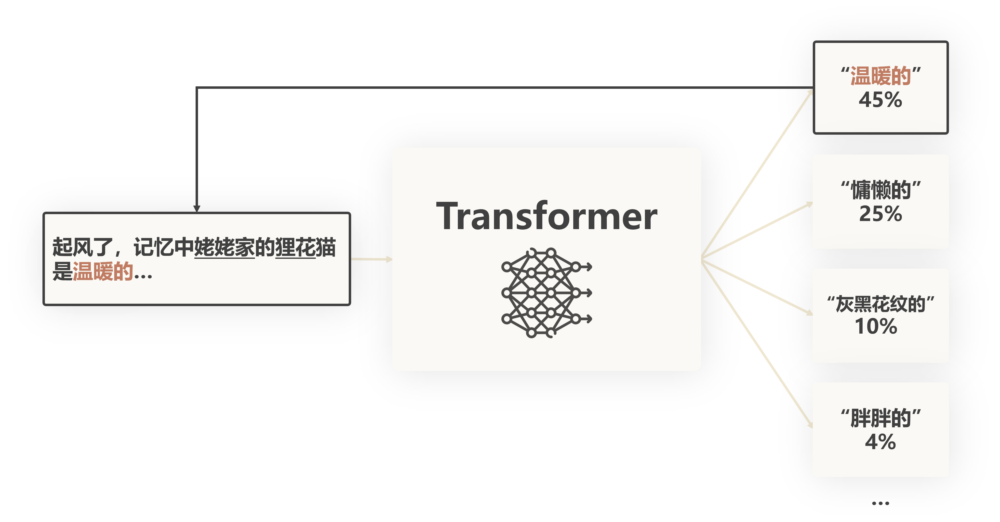

GPT-3 拥有 **1750亿个参数（175B）**，我们往往将这些参数称之为**权重**，这些参数可以看作模型的“记忆单元”或“神经元连接”。这些参数并不是随意设置的，而是在海量训练中学来的，最终形成了一套复杂但稳定的语言理解和生成机制。


##  线性代数速通指南：三分钟看懂大模型的“语言”

在深入理解 GPT 工作原理前，我们先来快速了解一些最基础但最关键的数学工具：**向量、点积和矩阵乘法**。你可以把它们看作是神经网络“沟通世界”的语言。

###  向量（[Vector](https://www.3blue1brown.com/lessons/vectors)）是什么？就像在多维空间里的“坐标点”或“箭头”

**定义：** 向量就是一组有顺序的数字，比如 `[3, 4]`、`[1, 0, -2]`，每个数字表示你在某个“维度”上的位置。

**向量**是最基础的数据结构。你可以把它理解为“在空间中的一个位置”或“一支箭头”。就像地图上的坐标 `[经度, 纬度]` 能精确标记你的位置，一个二维向量 `[3, 4]` 也能表示你在一个平面上的“点”，或者指向那个点的方向。在更高维的空间中，向量则可以表示更多特征的组合，比如在语言模型里，每一个词也会被表示成一个包含上百个维度的向量，记录了它的“语义坐标”。

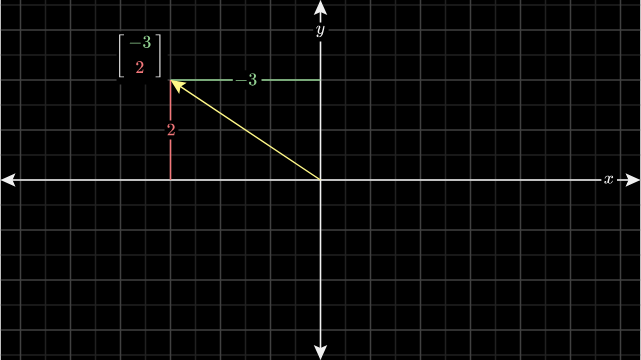

### 点积（[Dot Product](https://www.3blue1brown.com/lessons/dot-products)）：判断两个向量“像不像”

**定义：** 点积 = 向量长度 × 向量长度 × cos(夹角)

**点积**是一种衡量两个向量“方向相似度”的方法。它的数学定义是：两个向量的长度乘以它们夹角的余弦值。如果两个单位向量方向完全一致，点积就是最大的；如果方向完全相反，结果就是负的；而如果它们互相垂直，点积为零，说明它们“互不相关”。一个简单的例子是：如果你把向量和 x 轴方向的单位向量做点积，得到的就是它在“东西方向”上的投影值，类似于判断你在地图上的“横向位置”。在语言模型中，我们用点积来判断两个词的相似性，比如“狸花猫”和“暹罗猫”的词向量点积可能比“狸花猫”和“钝角”更大，因为它们更“对得上”。

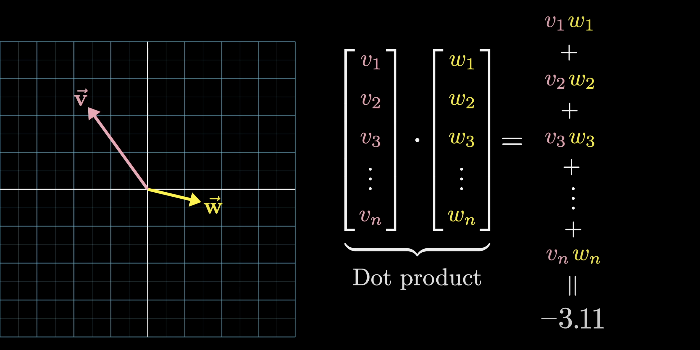

### 矩阵（[Matrix](https://www.3blue1brown.com/lessons/nonsquare-matrices)）乘向量：把一个向量“变形”或“换坐标系”

**定义：** 矩阵是多个向量排成的“表格”，矩阵乘一个向量就相当于对它进行一系列线性变换。

**矩阵乘以向量**可以看作是一种“变换”过程。它可以把一个向量转化为另一个维度的向量，类似于你在地图上切换投影方式或换一个参考系来看待同一个位置。在神经网络中，每一层的运算，本质上就是对输入向量做一系列矩阵乘法，从而将信息从一种表达方式变换成另一种。例如，把“猫”这个词的向量送入网络后，它会被多个矩阵一步步变换，最终变成对下一个词的预测分布。矩阵在这里扮演的是“滤镜”或“变换器”的角色，帮助模型从原始输入中提取出对任务有用的特征。例如，GPT-3 中的1750 亿个权重被组织成接近28,000个不同的矩阵。

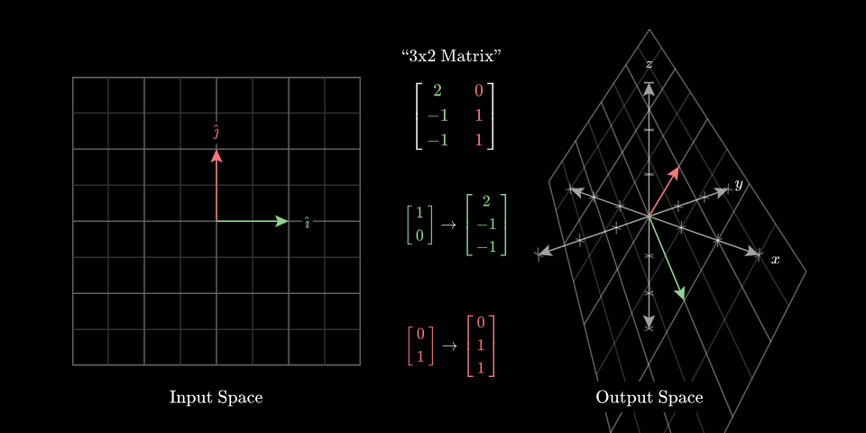

> **向量**是位置，**点积**是相似度，**矩阵乘法**是变换——这三者构成了深度学习的计算基础，也是我们理解 Transformer 和 GPT 模型内部运作的起点：模型如何表示词？如何判断词之间的关系？又是如何不断地“加工”这些信息——答案都藏在线性代数中。

接下来，我们将正式进入 Transformer 的世界，看看它是如何通过一层层的处理，把**“起风了，记忆中姥姥家的狸花猫是……”**变成**“灰黑花纹的”**，甚至还能写出一整篇小说、完成一道数学题。我们会从它的四个关键模块说起：**Embedding、Attention、MLP、Residual Stream**。

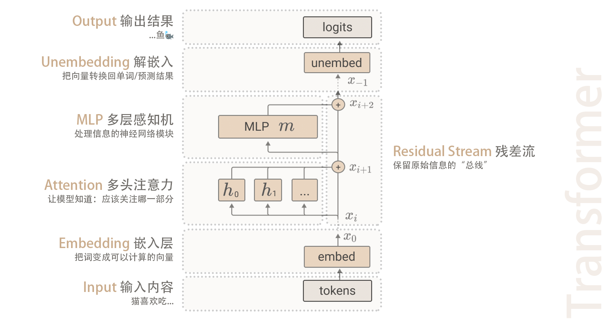


## 嵌入（[Embedding](https://www.3blue1brown.com/lessons/gpt)）：将词变成向量的第一步

我们刚才了解了向量、点积、矩阵乘法这些工具，它们是神经网络“运算语言”的基础。那么，GPT 是如何将人类的语言翻译成自己能理解的“运算语言”呢？

对模型来说，“狸花猫”这个词不过是几个字母的组合。它不会天生知道这是个中国本土的品种，甚至不知道这是一个完整的“词”。所以我们得首先把这些文字转换成 **数字**，就像Unicode编码那样。但语言模型用的不是简单的数字，而是更复杂、更有意义的“向量”。每个词都有自己的“坐标位置”在高维空间里，这样模型才能计算词和词之间的“远近”和“方向”。

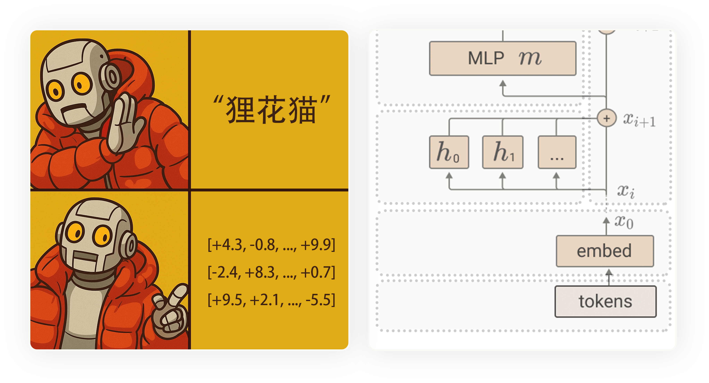文本在输入模型之前，会被拆分成更小的单位，叫做 **Token**，可能是词，也可能是词的一部分或符号。比如：

```html
To date, the cleverest thinker of all time was ...
→ To | date | , | the | cle | ver | est | thinker | ...
```

对于中文而言，一个token往往直接对应着一个汉字。


### 嵌入矩阵（Embedding Matrix）：模型的“词汇表”

语言模型拥有一个预定义的“词汇表”，比如 GPT-3 的词汇表包含约 50,000 个 token。每个 token 都会被转换成一个高维向量——这个转换过程就依赖于一个叫做**嵌入矩阵（embedding matrix）**的结构。

你可以把这个嵌入矩阵想象成一个查表工具，它的每一列都对应一个 token 的向量表示。我们记这个矩阵为 W<sub>E</sub>。这些向量的初始值是随机的，但会在模型训练过程中不断调整，最终学出每个 token 的“最佳表示”。

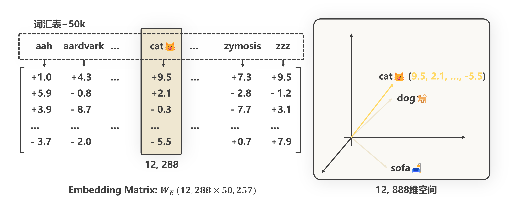

从几何角度看，这些向量就像是在高维空间中的点或方向。例如，对于 GPT-3 来说，每个 token 被嵌入到一个 **12,288 维** 的向量空间里。你可以将这个空间想象成一个超高维度的“语义地图”，每个词都有它的位置和方向。虽然我们无法直观想象12,000多个维度的空间，但可以理解成这样：

> **模型试图把“意义相近”的词放在“方向接近”的位置上**。就像现实地图上，北京和天津会靠得更近，而北京和墨尔本则相距遥远。这意味着北京和天津拥有某种共享的语义：即他们都是中国的城市。


### 向量的方向蕴含“意义关系”

一个训练良好的嵌入空间，会自发地形成一些**有意义的方向结构**：

> 假如你输入了**“猫”**这个词，它的词向量很可能会靠近**“狗”**、**“宠物”**等词，而不会靠近 **“沙发”**或**“物理”**。

这说明，模型通过训练，已经逐渐学会把“语义相关”的词放在空间中彼此靠近的位置。这种结构不是人工设定的，而是模型在阅读大量语料后“自己悟出来”的。就好像它在脑海中画了一张“猫咪世界地图”，知道什么猫彼此相似。

更经典的例子是**向量之间的“差值”也能表达概念**：

- 取 `woman (女人) - man (男人)` 得到一个“性别方向”；
- 再把它加到 `king (国王)` 上，你可能会得到接近 `queen (女王)` 的向量位置。

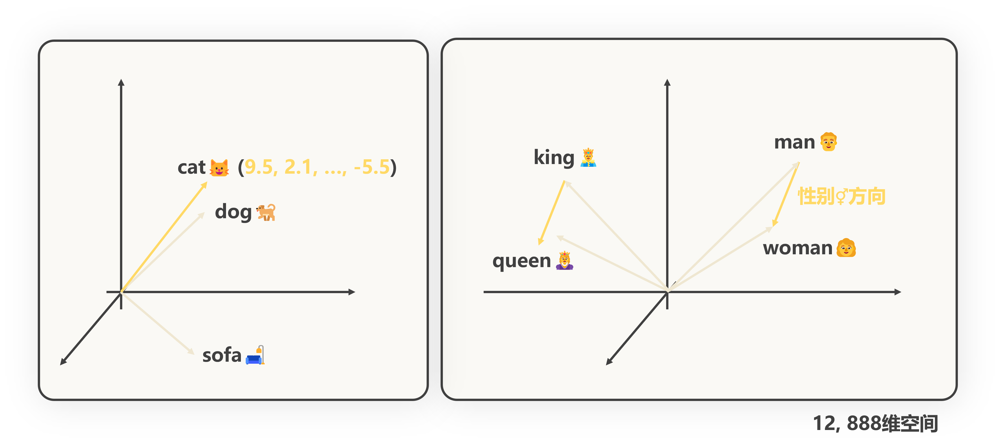

这意味着模型学会了某些方向可以表示性别、时态、国家、职业等语义变换。例如：

```python
king - man + woman ≈ queen
Italy - Germany + Hitler ≈ Mussolini
```

这类例子说明，**方向不仅表示位置，也可以编码概念上的“变换”**。

当然，现实模型未必总是这么“完美”，比如 `queen` 与 `king - man + woman` 之间可能有一定偏差，这取决于模型训练数据的丰富性和语义多样性。但整体来看，语言模型在训练过程中确实学会了把词嵌入到一种可以“做类比”、“做推理”的空间中。

虽然每个词都被嵌入到了高维语义空间中，听上去很聪明，但有个容易被忽略的事实是：

> **语言模型其实看不到单词的拼写，也无法理解词的“内部结构”。**

例如LLMs就无法理解`“strawberry”`中有多少个`“r”`。对于模型来说**`“strawberry”`**只是一串长度为12,888的数字。

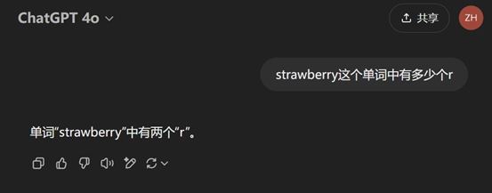

### 嵌入矩阵是模型的第一层权重

每个 token 的嵌入向量都存储在嵌入矩阵中，它是 Transformer 模型中的第一组权重。以 GPT-3 为例：

- 词汇表大小约为 **50,257**；
- 嵌入维度为 **12,288**；
- 总共包含 **617,558,016 个权重参数**。

这是我们“1750 亿参数”中非常重要的起点。它定义了模型如何从“文字”进入“向量空间”，为后续的注意力机制和多层感知机处理打下基础。


## 注意力机制（[Attention](https://www.3blue1brown.com/lessons/attention)）：模型如何“关注重点”并理解上下文？

上一节我们讲了：每个 token 会通过嵌入矩阵转换成一个高维向量，记录它的“初步语义位置”。但这些向量本身是**不包含上下文的**。也就是说，**“苹果”**这个词不论是在“**苹果**最新发布的手机”还是“上次买的**苹果**都放坏了”里，初始向量是一样的。那么，模型是如何根据上下文判断「苹果」到底是哪种意思的？这就需要 Attention 机制登场了。

> **Attention 的核心目标：让每个 token 找到和自己相关的上下文，再根据对应上下文语义信息来更新自己的语义。**

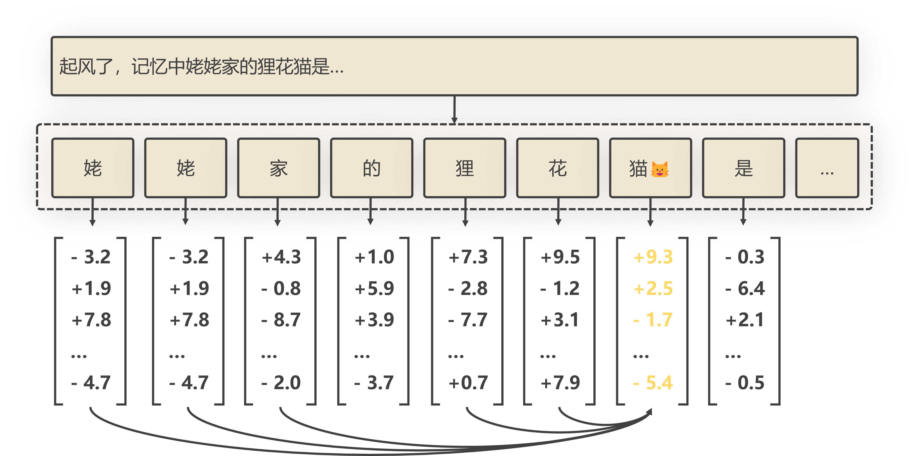

### Attention的数学原理：Query、Key、Value 三元组

我们来一步步看 Attention 的数学构造（看起来很吓人！不过别担心，我们会类比生活场景来解释它）：

| 步骤                          | 数学操作                                                     | 功能角色               |
| ----------------------------- | ------------------------------------------------------------ | ---------------------- |
| **Query（Q）**                | **Q **（`128`）= **W<sub>Q</sub>**（`128 × 12,288`） × **词向量**（`12,288`） | 我是谁，我想知道什么   |
| **Key（K）**                  | **K **（`128`）= **W<sub>K</sub> **（`128 × 12,288`）× **词向量**（`12,288`） | 我有什么特征           |
| **Q · K → Attention Pattern** | `Q · K^T → softmax(QK^T / √d)`                               | 决定你关注谁、关注多少 |
| **Value（V）**                | **V**（`12,288`） = **W<sub>V</sub> **（`12,288 × 12,288`）× **词向量**（`12,288`） | 我愿意分享什么信息     |
| **输出向量（注意力结果）**    | `Attention = softmax(QK^T / √d) × V`                         | 综合信息后的新向量     |

假设我们输入了一句话：

> “起风了，记忆中姥姥家的狸花**猫**是…”

我们关注的词是“猫”。在最开始，模型对“猫”的理解是很粗略的：一个动物，可能和“狗”差不多，也可能是“卡通形象”、“宠物用品”，总之没有上下文时，它只是一个刚经过Embedding处理的模糊词向量。它还不知道自己是狸花猫。

**第一步：每个词发出一个“查询”请求**

模型会为每个词构造一个 **Query 向量**（W<sub>Q</sub> × 词向量），可以理解为它发出的“提问方向”。比如“猫”的 Query 可以理解为：

> “我是只什么样的猫？” 

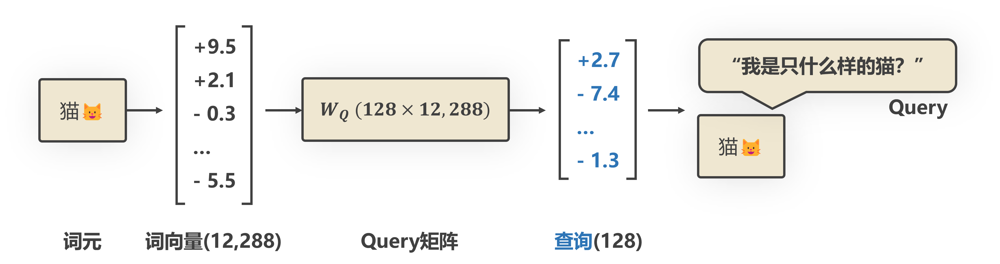

**第二步：每个词携带一张“名片”**

同时，每个词也会生成一个 **Key 向量**（W<sub>K</sub> × 词向量），表示自己的“身份特征”。

比如“狸花”的 Key：

> “我有‘毛色特征’这方面的信息。”

再比如“姥姥家”的 Key：

> “我带着‘家庭/情感背景’的信息。”

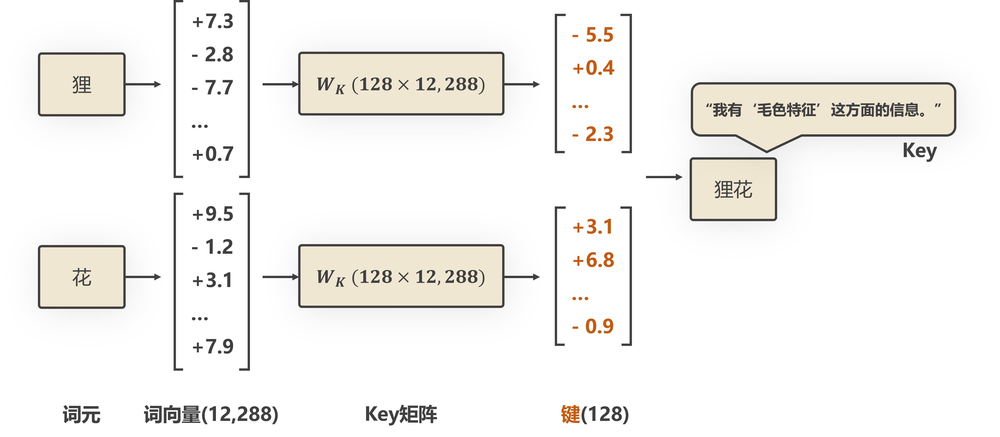

**第三步：匹配“问的人”和“被问的人”**

对于每个提问者（Query），模型会计算它和每个人的“匹配程度”，也就是计算点积（前文我们介绍过，两个向量点积的结果越大代表他们越相关）。

> **注意力分数（[Attention Pattern](https://transformer-circuits.pub/2021/framework/index.html)） =  Query 和 Key 的点积结果，再经过 softmax （后面我们会介绍）**

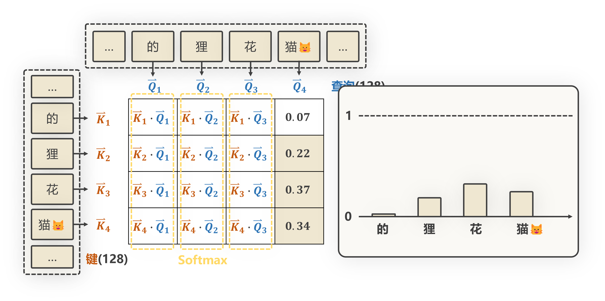

"猫"回头看了看，从“起风了”开始找和自己相关的文字，但是注意：不能偷看未来！我们会对这个Attention Pattern做一个操作叫做遮罩（masking），将每一个词后面的注意力分数都置为0，这样他们就不会偷看后面的答案，因为我们在生成文本的时候也是不知道后面的段落是什么样的。


**第四步：分享信息**

每个被关注的词会拿出自己的 **Value 向量**（W<sub>V</sub> × 词向量），也就是“我要传递的信息”：

> “狸花”的 Value 提供“是一种猫品种”；

> “姥姥家”的 Value 提供“亲切的归属感”。

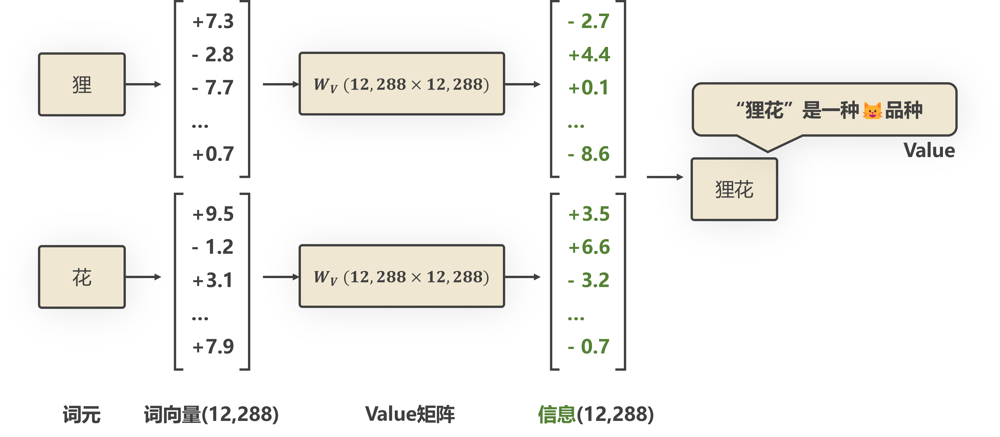 

模型会把这些值向量按照注意力权重加权平均，得到一个新向量，作为这个词新的“语义理解”。

**最终：每个词的向量都被“上下文信息”更新了**

于是，“猫”变得不再抽象，而是一个贴着“虎纹”、“亲情”的具体角色。

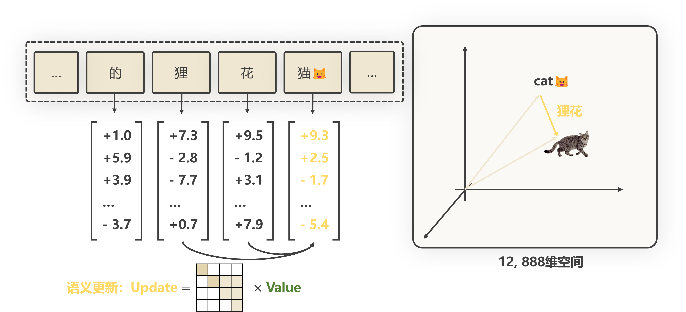


### 多头注意力：每个头关注一句话中的不同面向

在实际语言中，一个词的意思可能受到很多不同信息的影响：形容词修饰、主谓关系、事件线索等。注意力机制可以捕捉这些信息，但一个注意力头难以“面面俱到”，于是模型引入了**多个注意力头（multi-head attention）**。它们就像一个协作小组，**各司其职**地提取信息，最后把这些“不同角度的理解”合在一起，帮助模型更全面地理解每个词的意思。

在 GPT-3 中，每一层Attention有 **96 个头**，模型正是靠这些“96 种上下文理解方式”来精准建模语言中的模糊、歧义与隐喻。

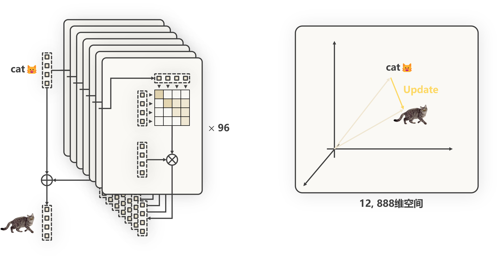


### 总结一下：Attention 是语言模型的“上下文信息采集器”

Attention 让每个词在上下文中“提问”、找到“相关词”、借用“有用信息”，更新“自己的理解”：

- Query 是“我是谁，我要知道什么”；
- Key 是“我是谁，我有什么特征”；
- Value 是“如果你找我，我能提供的信息”；
- Attention Pattern 是“我决定从谁那里听意见，以及听多少”；
- 输出是“我听完大家之后的理解更新”。


### 注意力机制的参数量：96个“专家”背后的重量级运算

以 GPT-3 为例，我们来计算一下模型建立注意力所需的权重数量：

- 每个 W<sub>Q</sub> 和 W<sub>K</sub> 都是大小为 `128 × 12,288` 的矩阵，约 **157 万个参数**；
- W<sub>V</sub> 原本是 `12,288 × 12,288`，但这会导致超过 1.5 亿参数，因此实际中采用了**低秩变换（low-rank transformation）**：
  - 先用一个降维矩阵 ↑W<sub>V</sub>（`128 × 12,288`）压缩信息；
  - 再用一个升维矩阵 ↓W<sub>V</sub>（`12,288 × 128`）还原维度；
  - 两个合起来也是约 **315 万参数**；
- 每个注意力头这四个矩阵参数加起来约 630 万约为 **630 万**。

而 GPT-3 的每一层包含 **96 个注意力头**，也就是说单层注意力部分就包含约 **6 亿参数**。模型一共有 **96 层**，所以：

> **注意力相关的参数总计接近 580 亿，约占 GPT-3 总参数量的 1/3。**

在这个结构中，模型从“孤立词义”过渡到“上下文语义”，但光是“听”还不够，接下来你得消化、归纳、判断、决策——这正是模型的下一步要做的事情。接下来，我们将认识 Transformer 中的另一个核心模块：**MLP（多层感知机）——模型用来真正“思考”的部分。**


## 多层感知机（[MLP](https://www.3blue1brown.com/lessons/mlp)）：模型如何“提取概念”、判断特征？

在前面的 Attention 部分，我们讲了模型如何从上下文中“打听消息”，借助 Query、Key、Value 找到重点信息。现在轮到模型自己“下判断”了：它能不能从这些信息中总结出概念、判断事实、做出推理？

这个关键步骤，就是通过 Transformer 中的第二个核心模块——**多层感知机（Multi-Layer Perceptron, MLP）** 来完成的。

> 可以这样理解：**Attention 是收集信息，MLP 是做决策判断的地方。**


### MLP的数学原理：两个矩阵 + 一个非线性函数

我们可以把 MLP 理解为这样一个过程：

> “模型拿到每个词的向量后，会**对这个向量提出很多问题**，根据回答的结果决定**要不要对它做一些改动**。”

这整个过程其实就是三步：

| 步骤           | 数学操作                     | 功能角色                     |
| -------------- | ---------------------------- | ---------------------------- |
| **升维**       | `W↑ × x` （49,152 × 12,288） | 问很多问题，看哪些能被回答   |
| **非线性激活** | `ReLU()`                     | 判断哪些回答值得参考         |
| **降维**       | `W↓ × h`（12,288 × 49,152）  | 把有价值的回答转换为新的改动 |

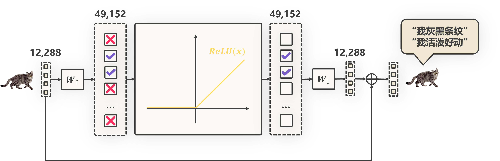


**第一步：升维矩阵 W↑（模型在“问问题”）**

想象我们有一个维度为 `12,288` 的词向量输入（这是 GPT-3 的大小），它将乘以一个更大的矩阵 `W↑`，比如：

> `W↑` 是一个 `49,152 × 12,288` 的矩阵，代表模型提出的 **49,152 个问题**。

每一行对应一个“问题方向”，比如：

- “你是篮球运动员吗？”
- “你是不是灰黑条纹的？”
- “你是不是活泼好动？”
- “你包含的是某种时间信息吗？”

对于每个问题，模型会计算：**词向量和这个问题方向对不对得上？**这本质上就是向量的点积——对得上就是“回答了这个问题”，数值大；对不上就是0甚至负值，表示不相关。

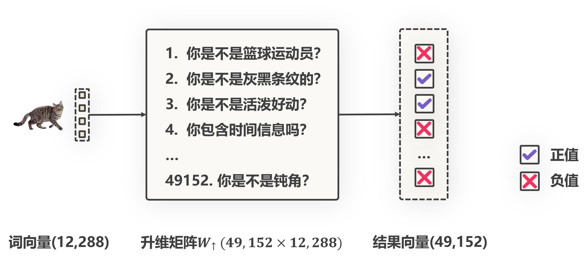


**第二步：ReLU（过滤掉“不重要”的回答）**

但模型不会对所有问题的回答都感兴趣。它还需要判断：

> “这个回答有没有意义？值不值得参考？”

这一步就用到了 **ReLU 函数**：如果回答是负的（不相关、意义不大），就被直接清零；只有那些回答是正的，才会留下来。

你可以把 ReLU 理解为 Attention 中的 **softmax 注意力权重**的平替：

- 在 Attention 中，softmax 是判断“我应该关注谁”；
- 在 MLP 中，ReLU 是判断“这个判断值不值得参考”。

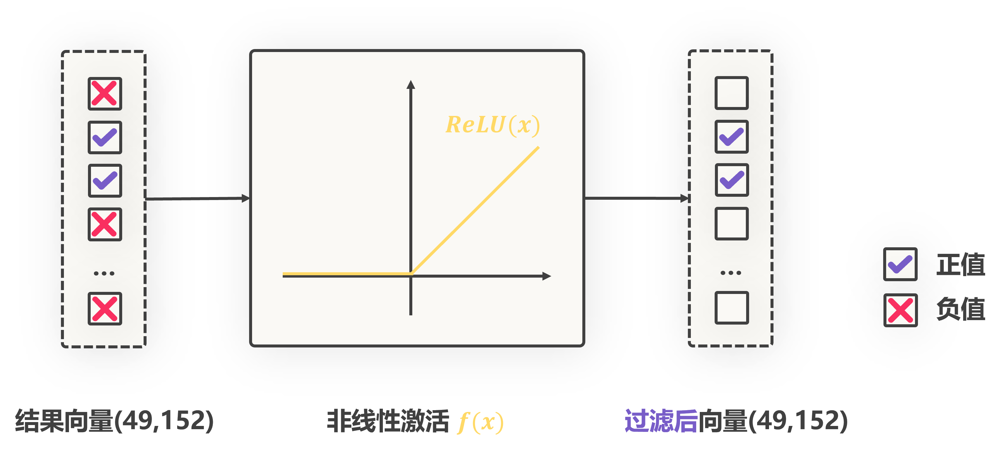


**第三步：降维矩阵 W↓（把判断转化为“语义更新” ）**

接下来模型用降维矩阵 `W↓`（大小为 `12,288 × 49,152`）把这些激活的回答，重新组合成一个新的向量。

你可以把它理解为：

> 模型把“判断结果”重新打包，形成“对原始向量的改动建议”。

这个过程就像 Attention 中的 **Value 向量**：

- 在 Attention 里，Value 是别人提供的信息；
- 在 MLP 里，W↓ 是模型自己总结出来的“结论”。

W↓ 会将这个激活的“是灰黑条纹的”信号，转化为一段方向是“灰黑条纹”的向量，加入到原始向量中；最终，这个 token 的表示中不仅有“狸花猫”，还多了条纹花色等的含义。

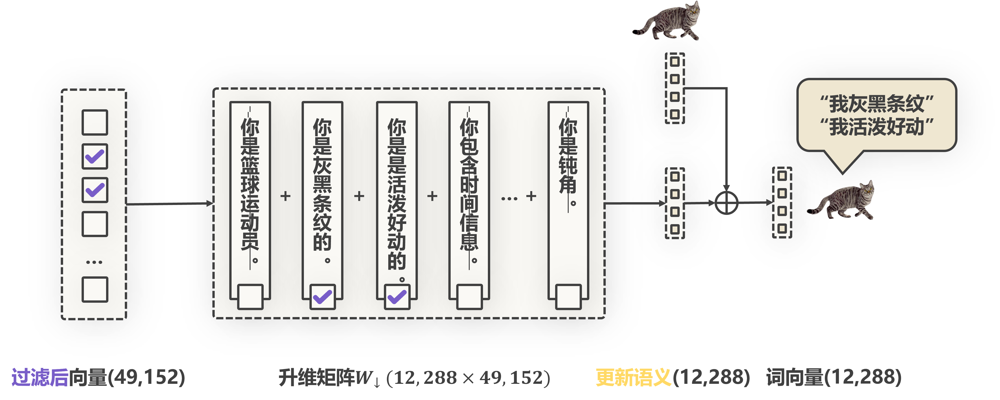


### 超维空间魔法：为什么 MLP 能学会这么复杂的判断？

我们刚刚提到，MLP 中的升维矩阵 `W↑` 可以理解为模型提出的 **49,152 个“问题”**，每一行都是一个方向——问的是“是不是篮球运动员”、“是不是中国城市”这样的抽象语义判断。

那么问题来了：

> **空间维度就只有 49,152，你怎么还能表示上亿种不同的概念和判断？**

这就引出一个神奇的现象——叫做 **Superposition（超叠加）**：我们都知道，一个 n 维空间最多能容纳 n 个**彼此完全正交（互不干扰）**的方向。也就是说：

> 如果每个“问题方向”都互相垂直，那我们最多只能提 n 个“互不干扰”的问题。

这正是数学中“维度”的定义：你最多能容纳多少条**独立方向**。但是！假设我们放宽条件，不要求“完美垂直”，只要求：

> 这些方向之间的夹角落在 **85° ~ 95°**，也就是“几乎互不干扰”。

也就是说，如果你允许这些方向信息”稍微“互相干扰，那么结果是：

> 你可以塞进远远超过 n 的方向数量——甚至可以**指数级增长**！

这是数学中著名的 [**Johnson-Lindenstrauss 引理**](https://en.wikipedia.org/wiki/Johnson%E2%80%93Lindenstrauss_lemma) 所揭示的一个现象：在高维空间里，你可以塞进指数级数量的“几乎正交”的向量。


### 总结一下：MLP 就是语言模型的“判断大脑”

- `W↑` 提出各种语义判断；
- `ReLU` 决定哪些判断值得参考；
- `W↓` 根据判断调整词向量；
- 每个词都独立完成一次“思想加工”。

> 如果 Attention 是模型的“眼睛”，那 MLP 就是它的“大脑”。


### 多层感知机的参数量：模型“思考力”的核心所在

继续以 GPT-3 为例，我们来看看 MLP 这个“思考引擎”中究竟包含了多少权重：

- 每个 MLP 模块中，包含两个关键矩阵：

  - 升维矩阵 W<sub>↑</sub>：大小为 `49,152 × 12,288`，共约 **6.04 亿个参数**；
  - 降维矩阵 W<sub>↓</sub>：大小为 `12,288 × 49,152`，也约 **6.04 亿个参数**；

- 加起来，**单个 MLP 就包含约 12.1 亿个参数**；

- GPT-3 一共 **有 96 层 MLP**，也就是说：**MLP 模块总共包含约 12.1 亿 × 96 = 116 亿个参数**。

这还不包括偏置项（bias）和归一化层（LayerNorm）等辅助参数，但这些加起来也不过几万，几乎可以忽略。

> 这意味着，整个模型中将近**三分之二**的参数都集中在 MLP 部分。


## 残差流（[Residual Stream](https://transformer-circuits.pub/2021/framework/index.html)）：模型的大脑“通信总线”

前面我们已经见到了两个模块：**Attention 机制是模型的“眼睛”，用来感知上下文”**，**MLP 是模型的“大脑”，用来进行概念提取和判断”**。那么它们之间是如何协作的？模型又是如何把这些处理结果“流转”到下一层的？

这就需要介绍一个关键结构——**残差流（Residual Stream）**，你可以把它理解为模型内部的信息“高速公路”或“共享笔记本”。

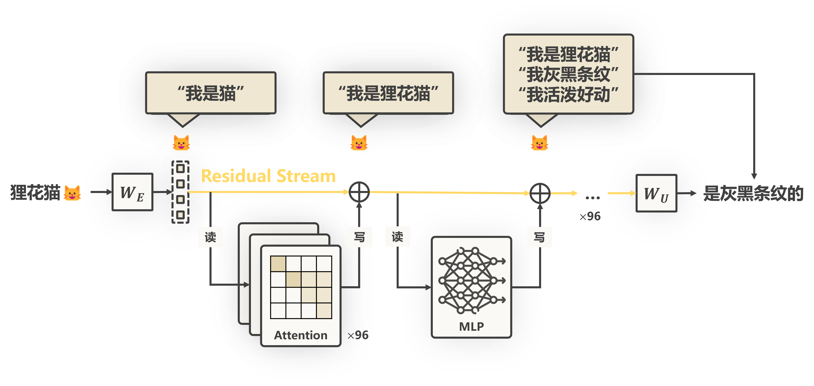

### 什么是 Residual Stream？像是模型的大脑“工作笔记本”

每个 token 的向量，在经过嵌入矩阵处理之后，就会进入一个叫做 **Residual Stream** 的空间中。之后每一层 Attention 和 MLP 模块，都会从这本“笔记本”中读取信息，处理后再写回这本笔记本。

> 你可以把它理解为：模型的大脑中，每个词都有一本“随身小本子”，记录了目前对它的理解。每一层网络就是在不断往这个小本子里加注解，丰富它的语义信息。

### 模块如何“读写” Residual Stream？

每个 Attention 和 MLP 层都会做两件事：

1. **读取（Read）**：从 Residual Stream 中提取当前的向量，作为输入；
2. **写入（Write）**：处理后将新的信息加到 Residual Stream 上。

这种机制的好处是：**所有模块都共享同一个信息通道，但彼此又可以独立处理**。

> 你可以理解为每一层都拿 Residual Stream 当前的向量做一份副本，在上面加工后，再把“加工结果”加回去。下一层再从这本“被不断追加笔记”的本子中继续处理。


### Residual Stream 是“语义的总线”，还是“记忆的容量”？

Residual Stream 本身是一个高维空间（比如 GPT-3 中是 12,288 维），所有模块之间的“沟通”都必须通过它。Attention 和 MLP 写入的结果就是向这个空间中“添加一个方向”。不同模块可以将信息写入不同的“子空间”，互不干扰。

这就像是一台机器：

- **Attention Head** 把“我注意到谁”这件事，记录在某几页；
- **MLP** 把“我觉得它的意思是…”的判断写在另几页；
- 最终这些“多手笔记”一起构成了模型对当前 token 的理解。


### 一个关键设计：Residual 是“加法结构”

注意每一层对 Residual Stream 的写入，不是替换，而是**加法**：

```
residual_next = residual_current + attention_output + mlp_output
```

这意味着每一层都在不断“追加”信息，而不是覆盖之前的理解。你可以把它想象成一个逐渐丰富的语义轨迹。

也正因为这种加法机制：

- 模型可以保留之前所有层的“记忆”；
- 也可以通过“写入负数”来“抹去”部分旧信息（就像用橡皮擦掉部分笔记）；
- 最终汇聚出一个包含所有层语义加工的“最终理解”，作为输出向量。


## 解嵌入（[Unembedding](https://www.3blue1brown.com/lessons/gpt#unembedding)）：模型如何“开口说话”？

前面我们讲了这么多，其实都是在回答一个问题：**模型如何“理解语言”？**而现在，轮到另一个问题了：**模型是怎么“开口说话”的？**

这个“开口说话”的过程，靠的是 **Unembedding（解嵌入）**：和嵌入相对，是一张反向词汇表，它会把内部运算结果“翻译”成我们看得懂的文字。

> 模型要从一个**向量**变出一个**词**，这正是解嵌入矩阵的工作。


### Unembedding的数学原理：从向量 → 概率分布

假设我们已经得到了某个 token 的最终表示向量（通过多层 Attention 和 MLP 加工之后的结果），接下来模型要做的就是：

1. 用一个 **解嵌入矩阵 W<sub>U</sub>**，把这个向量映射成一个很长的列表，每一项对应词汇表中的一个 token；

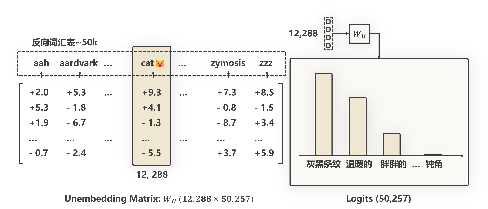

1. 用一个 **Softmax 函数**，把这些值转换成一个 **概率分布**，即：每个词出现的可能性。

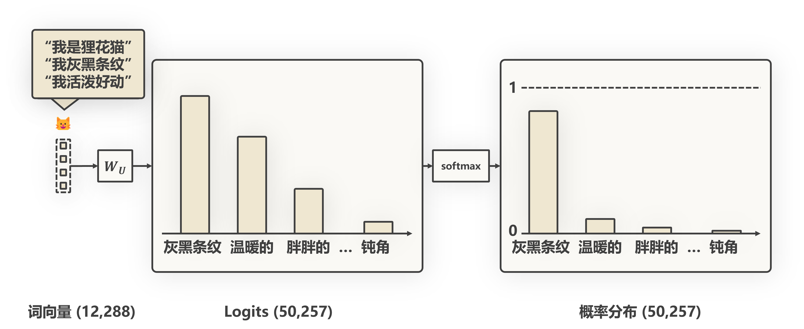

这个过程的数学表达式是这样的：

```
logits = W_U · h  →  [x1, x2, ..., x50257]  # 每个词的“分数”
probabilities = softmax(logits)             # 转成概率分布
```

其中：

- `h` 是模型最后一层的输出向量，维度为 `12,288`（以 GPT-3 为例）；
- `W_U` 是一个 `50,257 × 12,288` 的矩阵（词汇表大小 × 嵌入维度）；
- `logits` 是一个包含所有词“得分”的列表，Softmax 负责把这些分数变成 0~1 的概率。

你可以这样理解这个过程：

- 解嵌入矩阵 **W<sub>U</sub>** 就像是一个 **“翻译器”**，把高维的模型内部语言，翻成“下一个词可能是什么”：一个词汇得分表（logits）；
- 而 **Softmax** 则是一个 **“选词器”**，它会告诉模型：在所有词中，哪几个最有可能是下一个：将分数转换为选择的概率。

想象一下，我们之前给模型输入了这段话：

> “起风了，记忆中姥姥家的狸花**猫**是…”

此时模型内部通过解嵌入矩阵 W<sub>U</sub> 得到了这样一组 **logits**（打分，还不是概率）：

```
“灰黑条纹”：12.6  
“温暖的”：11.2  
“胖胖的”：6.1  
“钝角”：-1.3  
```

这些数字可以大于1，也可以为负，更重要的是：**它们加起来并不等于1，也不能直接拿来当概率使用。**

接下来，**Softmax** 登场了：

1. 首先对每个数值取指数（`e^x`），把它们都变成正数，并拉开差距；
2. 然后把这些正数 **归一化**，除以总和，让它们加起来变成1；
3. 最终得到的，就是一份标准的 **概率分布**：

```
softmax(12.6)  ≈ 296558.56529820286
softmax(11.2)  ≈ 73130.44183341545
softmax(6.1)   ≈ 445.85777008251677
softmax(-1.3)  ≈ 0.2725317930340126
总和 ≈ 370135.137433

换算成概率：
“灰黑条纹”：296558.56 / 370135.13 ≈ 0.80121700240223
“温暖的”：73130.44 / 370135.13 ≈ 0.1975776802507856
“胖胖的”：445.85 / 370135.13 ≈ 0.0012045810434915241 
“钝角”：0.27 / 370135.13 ≈ 7.36303488838536e-07
```

可以看到，Softmax 不仅保证了总和为 1，还放大了得分之间的差异：**得分高的词被进一步强调，得分低的几乎被压成 0。**

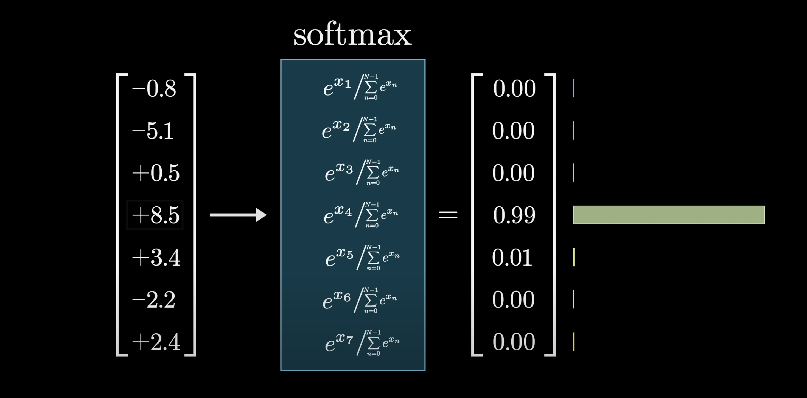


### Sampling 策略：模型是“自由发挥”，还是“按部就班”？

在实际生成文本时，语言模型面对一长串的词概率列表（Softmax 的输出），到底是怎么决定下一个词的？这背后有几种策略，我们最常见的两个是：

**1. Temperature（温度）：控制分布的“陡峭程度”**

- **温度高**（T > 1）：分布更平滑，模型更随机；
- **温度低**（T < 1）：分布更陡峭，模型更保守；
- **温度 = 0**：等价于 argmax，总是选概率最大的词。

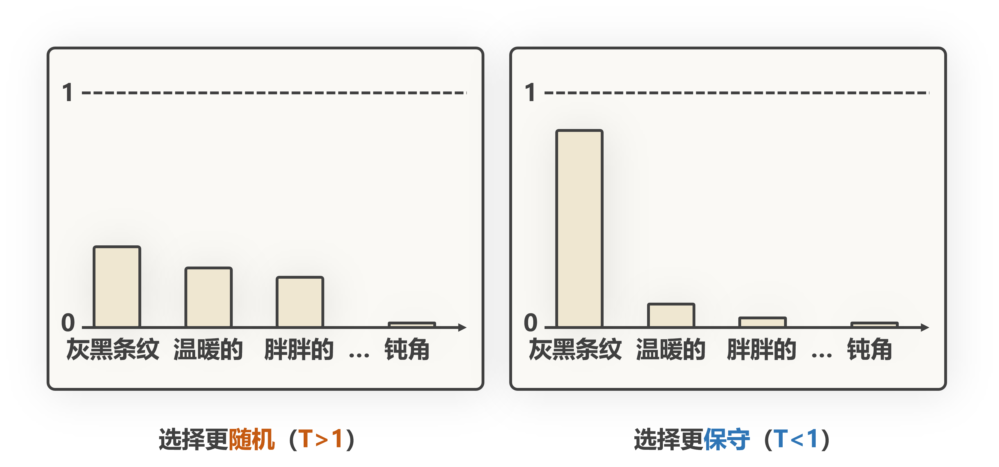

但 temperature 是“全局修改”，它会改变整个概率分布的形状。有时候我们希望**局部控制**生成——比如只从前几个最可能的词中选择，这时候就要用：


**2. Top-p（核采样）：只从“高概率区域”中抽样**

top-p 是一种非常聪明的策略，它的意思是：

> **我不从所有词中选，只从累计概率加起来超过 p 的“高概率区域”中抽样。**

你可以想象这么一个过程：

1. 模型输出了一个 50,000 个词的概率分布；
2. 我们把这些词按概率从高到低排序；
3. 然后从前面累计概率加起来大于 `p` 的那几个词中抽样。

举个例子：

- 如果 `top_p = 0.9`，那么只从**累计概率加起来前90%的词**中选择；
- 后面那些罕见词（即便它有一点点概率），会被直接忽略。

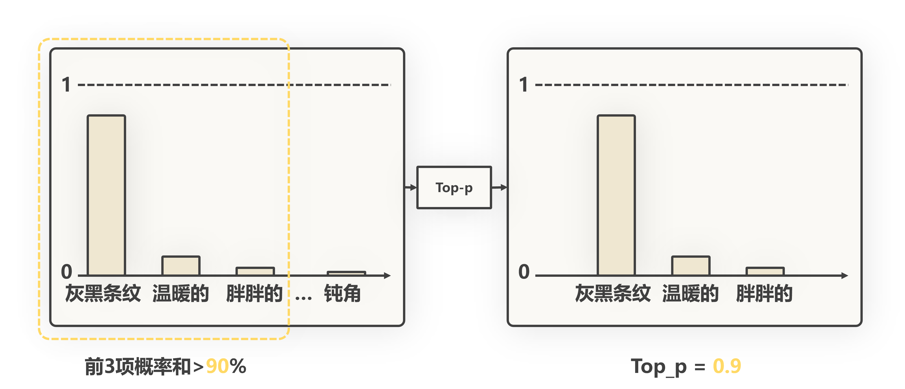

这种策略的好处是：

> 它不会受到极端大概率值的“压制”，也不会出现太小概率的奇怪输出，**兼顾创造性和合理性**。


### 模型是怎么训练出来的？为什么训练可以“并行”，生成却要“一个一个来”？

到目前为止，我们讲清楚了模型“如何从向量中选词”的流程：解嵌入矩阵提供 logits，Softmax 转换成概率，然后选出下一个 token。

但是你可能会有疑问：

> “模型每次只能预测一个词，那训练起来不是很慢吗？”

其实并不会，GPT 模型在训练时使用了一个叫做 **Teacher Forcing** 的技巧，让整个序列的预测可以并行处理，大大提高了效率。GPT 是一种 **自回归模型（autoregressive model）**，它的核心原则是：

> **预测下一个词，只依赖于已经出现的词。**

举个例子，对于这句话：

```
"猫喜欢吃鱼"
```

模型在预测时是这样处理的：

| 位置 | 输入 | 目标（下一个词） |
| ---- | ---- | ---------------- |
| 1    | 猫   | 喜欢             |
| 2    | 喜欢 | 吃               |
| 3    | 吃   | 鱼               |
| 4    | 鱼   | [END]            |

注意，这里每个 token 的目标是 **它后面的那个词**，这就构成了一个预测任务。但是在训练阶段，我们已经知道完整的输入序列，所以可以让模型 **一次性并行地预测所有位置的下一个词**，不需要像推理时那样一个词一个词地生成：

也就是我们可以同时对`喜欢|吃|鱼|[END]`进行判断


### 总结一下：解嵌入和 Softmax 是“最后一公里”

在模型完成了嵌入、注意力、判断之后，它还需要走完最后一步：把“理解”变成“语言”：

- **Unembedding（解嵌入）** 是模型的翻译器，把向量变成词得分；
- **Softmax** 是词的投票器，把打分表变成概率分布；
- 最后输出的那个词，就是概率最高（或被随机抽中）的选项。

而这个词，会成为下一个 token 的输入，一步步延续下去，形成我们熟悉的“语言流”。


<br>

# 从 GPT-3 到 GPT-3.5：模型是如何“学会当助手”的？

前面我们已经讲清楚了：GPT 是如何通过嵌入、注意力、MLP 和残差流一步步理解语言的。但这还只是**“预训练语言模型”**（Pretrained Language Model），它只是学会了：**如何预测下一个词**。

> 那么问题来了：GPT-3 怎么“变成”我们现在使用的 ChatGPT 这样的“AI 助手”呢？

这背后的关键步骤是：**使用人类设计的提示词（Prompt）和额外训练，让模型学会“以某种角色进行回答”**。

试想我们直接输入下面这句话：

```
Rewrite the following sentence in a polite tone:
Give me the report now.
```

#### 没有提示词时，模型可能会像这样续写：

```
Rewrite the following sentence in a polite tone:
Give me the report now. You need to submit it by 5 PM.
```

也就是说，它**只是在写下一句话或继续续写场景**，并没有真正执行“重写”这个指令。

#### 加上提示词后，模型的行为立刻改变：

```
system: You are a helpful assistant who rewrites sentences in a polite tone.
user: Rewrite the following sentence in a polite tone:
Give me the report now.
assistant:
```

此时它会更可能给出：

```
Could you please send me the report at your earliest convenience?
```

这是因为现在它“知道”自己是一个礼貌助手，而且“知道”用户的意图是**请求重写而非补全文段**。


### 后训练阶段：从“预测下一个词”到“理解人类意图”

我们说 GPT-3 变成 ChatGPT，离不开三个重要的后训练技术：**SFT、RLHF 和 DPO**。它们的目标都是让模型“更懂人意”，但方式不同。

**1. SFT（监督微调）——“模仿好回答” **

- **做法**：收集成千上万个高质量问答对，让模型学习“如果用户这么问，应该这么答”。
- **示例数据**：

```
用户：请解释什么是量子纠缠。
助手：量子纠缠是一种量子物理现象，两个粒子的状态会彼此关联，即使它们相距很远……
```

- **目标**：模仿“好助手”的回答方式。


**2. RLHF（基于人类反馈的强化学习）——“奖励更优回答”**

- **做法**：先让模型对同一个问题给出多个回答，再由人类打分出“哪个更好”。再训练一个奖励模型，然后用强化学习（如 PPO）来优化原始模型。
- **示例数据（排序打分）**：

```
Prompt: 解释什么是黑洞。

A. 黑洞是宇宙中的一个区域，引力强到光都无法逃脱。（👍👍👍）
B. 黑洞就是宇宙的垃圾桶，啥都能吸进去。（👎👎）
```

- **目标**：不是模仿特定回答，而是更偏向“人类觉得好的答案”。


**3. DPO（直接偏好优化）——“不训练奖励模型，直接优化偏好”**

- **做法**：仍然使用人类对比的偏好数据（比如“我更喜欢 A 而不是 B”），但**不训练奖励模型**，而是直接用这些偏好对原始模型做优化（更稳定、更高效）。
- **示例数据（偏好对）**：

```
Prompt: 用通俗语言解释进化论。

Preferred: 进化论是说生物会随着时间慢慢变化，适应环境，好的特征保留下来。
Less preferred: 进化论是达尔文提出来的，讲的是物种起源。
```

- **目标**：更简洁、少步骤地学会“人类更喜欢的风格”。


<br>

# 拓展阅读

**0. 开山之作**

- [Attention Is All You Need](https://arxiv.org/abs/1706.03762)


**1. 3Blue1Brown**

- [什么是神经网络？](https://www.3blue1brown.com/lessons/neural-networks)
- [什么是GPT？Transformer的可视化讲解](https://www.3blue1brown.com/lessons/gpt)


**2. Transformer Circuits（Anthropic）**

**新闻**

- [追踪大语言模型的思维过程](https://www.anthropic.com/news/tracing-thoughts-language-model)
- [绘制大语言模型的心智地图](https://www.anthropic.com/research/mapping-mind-language-model)

**论文与研究**

- [Transformer电路的数学框架](https://transformer-circuits.pub/2021/framework/index.html)

- [逆向工程视觉模型](https://distill.pub/2020/circuits/)

- [上下文学习与诱导头](https://transformer-circuits.pub/2022/in-context-learning-and-induction-heads/index.html)

- [单义性可扩展性：从Claude 3 Sonnet中提取可解释特征](https://transformer-circuits.pub/2024/scaling-monosemanticity/)

- [电路追踪：揭示语言模型中的计算图](https://transformer-circuits.pub/2025/attribution-graphs/methods.html)

- [语言模型的生物学视角](https://transformer-circuits.pub/2025/attribution-graphs/biology.html)

- [叠加、记忆与双下降现象](https://transformer-circuits.pub/2023/toy-double-descent/index.html)


**3. LessWrong**

- [事实探寻：试图在神经元层面逆向工程事实召回机制（第一篇）](https://www.lesswrong.com/posts/iGuwZTHWb6DFY3sKB/fact-finding-attempting-to-reverse-engineer-factual-recall)
- [大模型的拒答行为由一个方向控制](https://www.lesswrong.com/posts/jGuXSZgv6qfdhMCuJ/refusal-in-llms-is-mediated-by-a-single-direction)